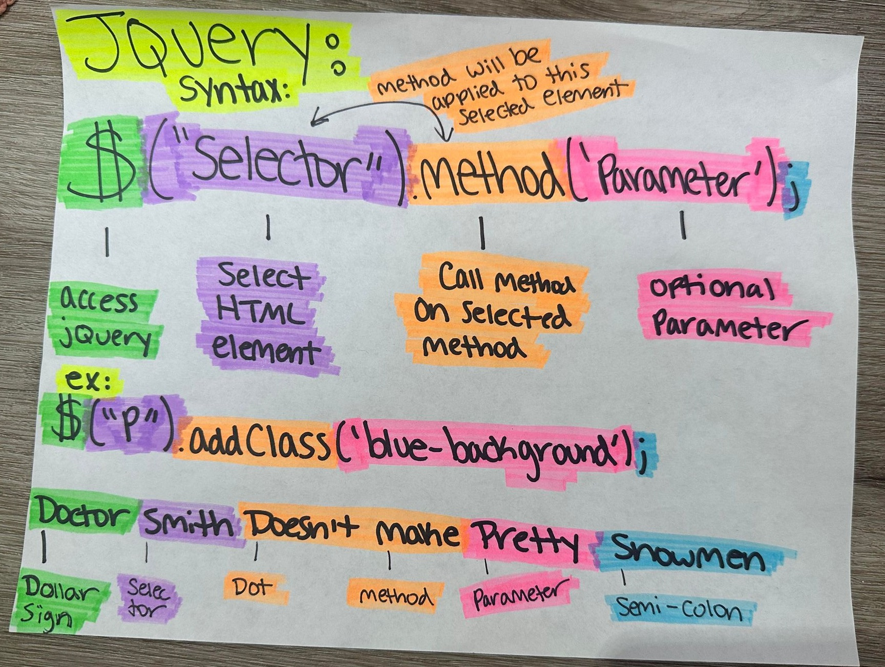
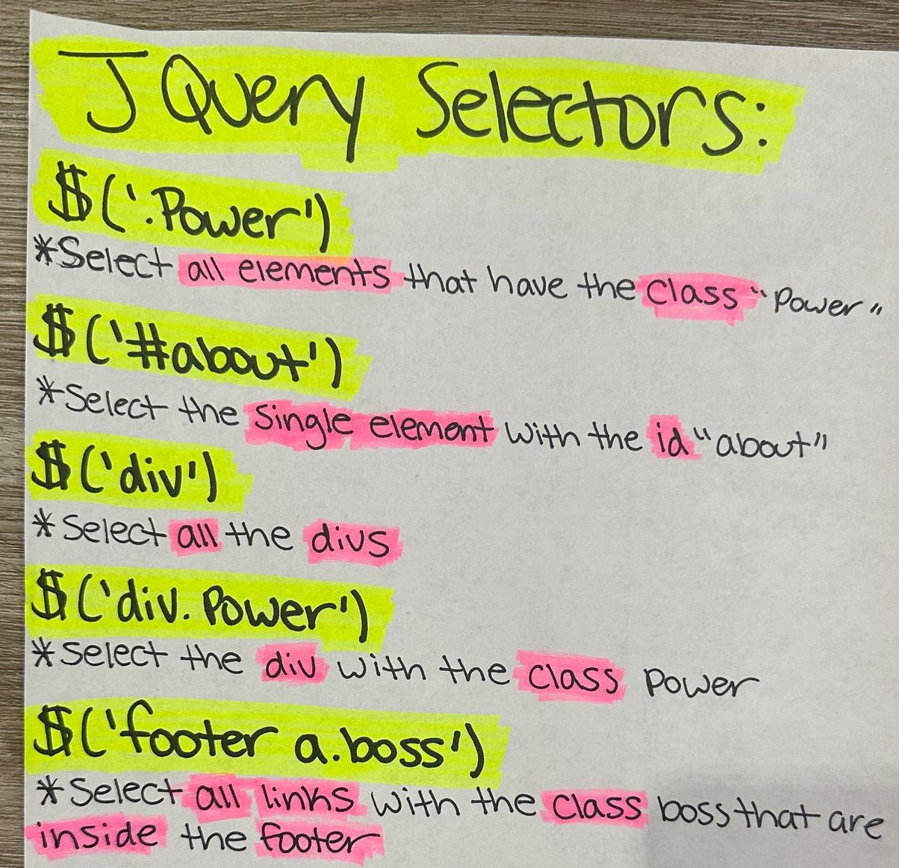
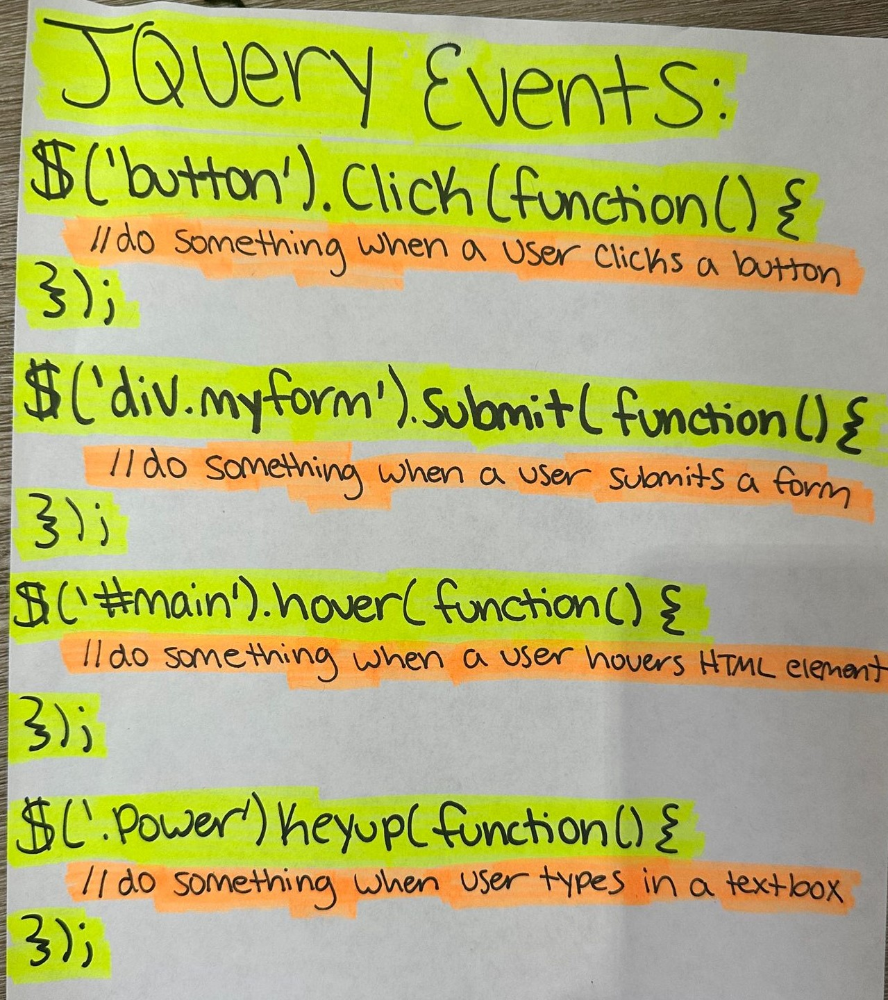

# module-five-challenge-api-day-schedule

## Description

A work day planner that allows a user to create a schedule. When user opens the planner, then the current day is displayed at the top of calendar. When user scrolls down, planner should show hours 9AM - 5PM. Each time block is color-coded to indicate whether it is in the past, present, or future. Past Time should be in the color grey, Present Time should be in the color Red, & Future Time should be in the color green. When user clicks into a time block, user should be able to enter an event & click the save button for that time block. Text should be saved into local storage, & when user refreshes the page, then the saved events persist. I have added a reset button to the bottom so user can clear everything, but in doing so, willclear everything from local storage. 

I was provided starter code for this project. (I have added the link to that starter code down below) I have added my own JavaScript code featuring jQuery & day.js. Bootstrap, Google Fonts, Fonts Awesome were already in file for styling. 

## Table of Contents:file_folder:
- [Installation](#installation)
- [Usage](#usage)
- [Credits](#credits)
- [License](#license)
- [How to Contribute](#How-to-Contribute)
- [Badges](#Badges)
- [Tests](#Tests)
- [Features](#Features)

## Installation:computer:

I was provided a gif of what my work should look like.:arrow_down: 
 

  

I was also provided with starter code::arrow_down: 
 

[crispy-octo-meme-starter-code](https://github.com/coding-boot-camp/crispy-octo-meme/tree/main)

 
 
Github link: https://github.com/pmastropolo/module-five-challenge-api-day-schedule

Portfolio Website Link: 

## Usage :open_file_folder:

Github link: https://github.com/pmastropolo/module-five-challenge-api-day-schedule

Portfolio Website Link: 

## Credits

Here are the following links I used to help write my code: 

### jsdelivr:
 

- [cdn](https://www.jsdelivr.com/)

### day.js:
 

- [Format day.js](https://day.js.org/docs/en/display/format)
- [Now](https://day.js.org/docs/en/parse/now)
- [Hour](https://day.js.org/docs/en/get-set/hour)

### Bootstrap:
 

- [Row columns gutters](https://getbootstrap.com/docs/5.1/layout/gutters/#row-columns-gutters)
- [Containers](https://getbootstrap.com/docs/5.0/layout/containers/)
- [Starter Template](https://getbootstrap.com/docs/5.1/getting-started/introduction/)

### jQuery:
 

- [jQuery Examples W3Schools](https://www.w3schools.com/jquery/jquery_examples.asp)
- [jQuery Misc Methods](https://www.w3schools.com/jquery/jquery_ref_misc.asp)
- [jQuery HTML/CSS Methods](https://www.w3schools.com/jquery/jquery_ref_html.asp)
- [Difference between $(this) and ‘this’ in jQuery](https://www.geeksforgeeks.org/difference-between-this-and-this-in-jquery/#)
- [document ready](http://learn.jquery.com/using-jquery-core/document-ready/)
- [ready](https://api.jquery.com/ready/#ready-handler)

### Misc:
 

- [this JavaScript W3Schools](https://www.w3schools.com/js/js_this.asp)
- [HTML Input Types](https://www.w3schools.com/html/html_form_input_types.asp)
- [HTML Data Attributes W3Schools](https://www.w3schools.com/tags/att_global_data.asp)
- [Provisional headers warning](https://developer.chrome.com/docs/devtools/network/reference/?utm_source=devtools#provisional-headers)

<!--- Unsure If I Can Add School Notes So Will Comment This Out For Now
[UC Davis Assignments - ACT 1 - jQuery Elements](https://git.bootcampcontent.com/University-of-California---Davis/UCD-VIRT-FSF-PT-06-2023-U-LOLC/-/tree/main/05-Third-Party-APIs/01-Activities/01-Ins_jQuery-Elements)
[UC Davis Assignments - ACT 25 - Object This](https://git.bootcampcontent.com/University-of-California---Davis/UCD-VIRT-FSF-PT-06-2023-U-LOLC/-/blob/main/03-JavaScript/01-Activities/25-Ins_Object-This/script.js)
[]

-->

*Hand-written Notes:* 
 

### fonts:
 

- [Font Awesome](https://fontawesome.com/)
- [Font Awesome Different Icons](https://fontawesome.com/v5/icons/save?f=classic&s=light&sz=lg&pc=%231b9dee)
- [Google Fonts](https://fonts.google.com/)

## License

N/A

## How to Contribute :tada:

N/A

## Badges :trophy:

N/A

## Tests

N/A

## Features :sparkler:

N/A
